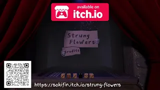
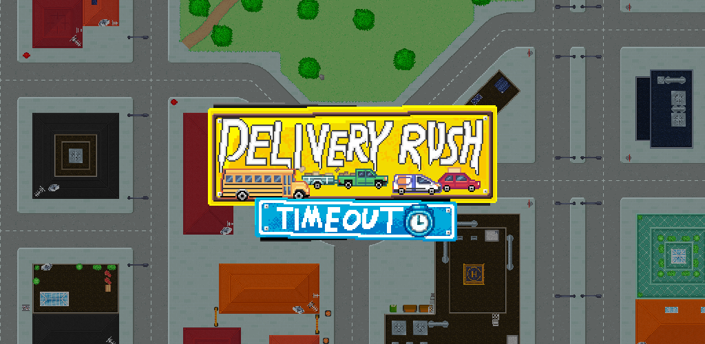
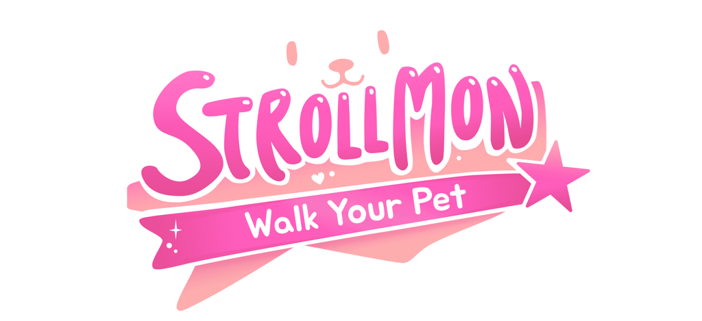

# About me 

       
  I'm Alexander, a game developer passionate about UI design, UI programming, and developing games for mobile platforms but always open to other ways to improve my skills.
   
  I've always been interested in user interface design and how to make interfaces more accessible for everyone. I enjoy creating UI that improves the player's experience and makes games more enjoyable.

### Projects

  
<b>▸ Strung Flowers | Windows 10 - 11 Game</b>

  
  

    3D Dice deckbuilder roguelike made with Unity.
    
<b>My contribution</b>

  

  

    <ul>
      <li>Basic enemy AI that throws dice and tries to throw dice to get optimal dice outcomes.</li>
      <li>Shop & Inventory logic that remembers dice added to the deck.</li>
      <li>Camera side-to-side movement allowing 180° rotation.</li>
      <li>Editing & filming the trailer.</li>
    </ul>
  

  

    <a href="https://sokifin.itch.io/strung-flowers" target="_blank" style="text-decoration: underline;">
      
        <b>Check out itch.io page</b>
      
    </a>
  

   
  

      <iframe width="625" height="300"
          src="https://www.youtube.com/embed/tn564fJtAK0"
          title="Trailer of the game"
          frameborder="0"
          allow="accelerometer; clipboard-write; encrypted-media; gyroscope; picture-in-picture; web-share"
          allowfullscreen>
      </iframe>
  

 

  
<b>▸ Delivery Rush: Timeout | Mobile Game</b>

  
  

    Time attack mobile game with vehicle deliveries in a city, made with Unity.
    
<b>My contribution</b>

  

  

    <ul>
      <li>UI design.</li>
      <li>Main menu logic.</li>
      <li>Pause logic.</li>
      <li>Shop logic with unlockable cars using in-game credit.</li>
      <li>Editing & filming the trailer.</li>
    </ul>
  

  

    <a href="https://the-grape-king.itch.io/delivery-rush-timeout" target="_blank" style="text-decoration: underline; color:#fa5c5c;">
      
        <b>Check out itch.io page</b>
      
    </a>
  

   
  

    <iframe width="625" height="300"
        src="https://www.youtube.com/embed/KqmBHCEO14Y"
        title="Trailer of the game"
        frameborder="0"
        allow="accelerometer; clipboard-write; encrypted-media; gyroscope; picture-in-picture; web-share"
        allowfullscreen>
    </iframe>
  

 

   
  
<b>▸ Strollmon - Walk Your Pet | Mobile Game</b>

  
  

    3D game with 2D walk scene where players earn currency to customize their pet, made in Unreal Engine 5.
    
<b>My contribution</b>

  

  

    <ul>
      <li>Step counter calling STEP_COUNTER API sensor via C++ → Java with static functions.</li>
      <li>Main room UI logic in Blueprints.</li>
      <li>Walk scene logic in Blueprints calling C++ classes.</li>
    </ul>
  

  

    <a href="https://nakkivene.itch.io/strollmon-walk-your-pet" target="_blank" style="text-decoration: underline; color:#fa5c5c;">
      
        <b>Check out itch.io page</b>
      
    </a>
  

### Studies

  Kajaani University of Applied Sciences,  
  Bachelor of Business Administration, Game Development:

  2023 - 2026

### Contact me.

 

  <a href="mailto:emil.vaisanen01@hotmail.com" style="text-decoration: underline; color:#0000FF;">
    <b>Contact me via Email</b>
  </a>  

  
  <a href="https://www.linkedin.com/in/emil-v%C3%A4is%C3%A4nen/" target="_blank" style="text-decoration: underline; color:#0000FF;">
    <b>   LinkedIn</b>
  </a>

